Lv20まで、あと少し。

数字だけを見れば、本当にあと少しだった。

でも、この日のリクはなかなか前へ進めなかった。

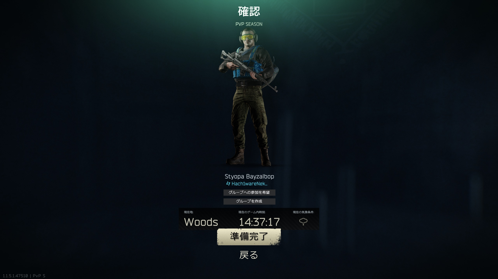

PMCで出撃しては倒される。

「あと少し」が見えているからこそ、一回の敗北がいつもより重く感じる。

レベルは上がっている。
装備も少しずつ良くなっている。
マップのことだって、以前よりずっと分かるようになった。

それなのに本人から出てきた言葉は、

「全然強くなってる感じしなくて……」

だった。

## 聞こえていたのに、分からなかった

Ground Zeroの建物内。

階段付近で止まったリクには、足音が聞こえていた。

上にもいる。  

下にもいる。

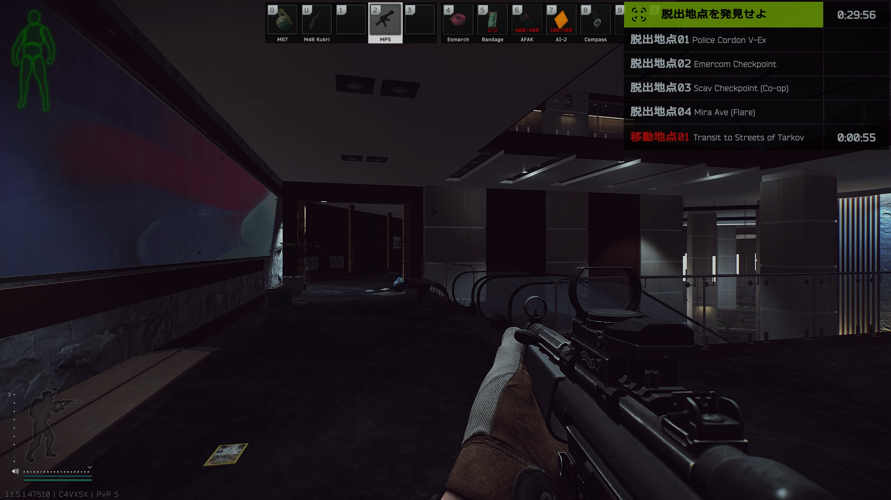

音そのものは、ちゃんと拾えていた。

問題は、その意味だった。

リクは「ひとりの敵が移動している」と考えた。

けれど実際には、ふたりいた。

ひとり目とは撃ち合って、倒すことができた。

でも、その瞬間に戦闘が終わったと思ってしまった。

弾も使い切り、次の相手への準備ができないまま、もうひとりに倒された。

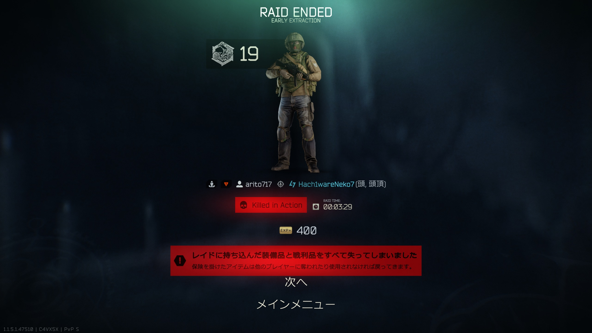

あとから振り返れば、

「上にもいる。下にもいる」

という時点で、答えは聞こえていたのかもしれない。

でも、聞こえることと、そこから状況を組み立てることは別だった。

この日のGround Zeroで分かったのは、足音を聞くことだけじゃなく、

**「何人いる？」**

まで考えなければならない、ということだった。

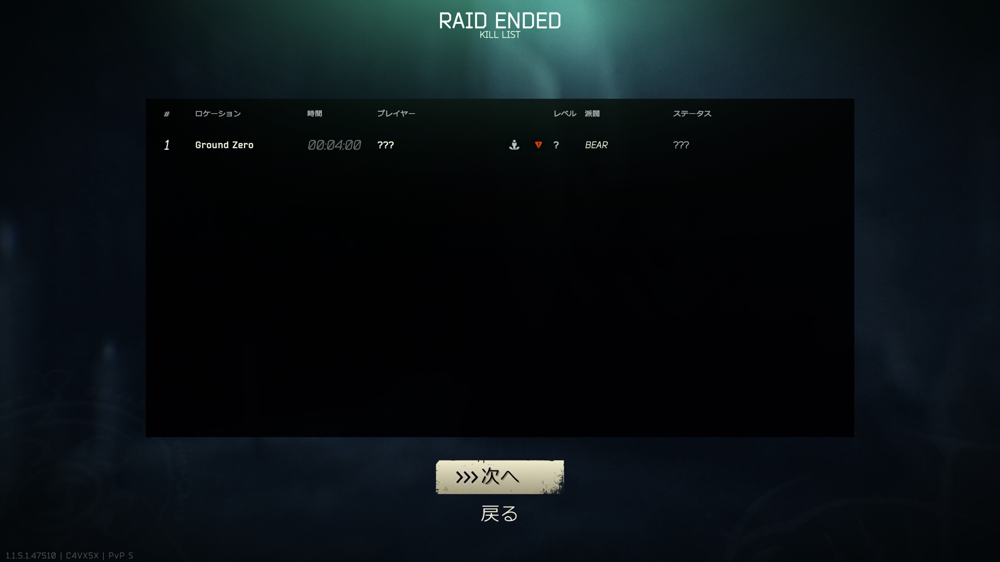

ひとり倒せた。

それでも、生還はできなかった。

結果だけを見れば、またひとつの敗北だ。

でもジャービスには、少し違って見えていた。

敵の音を聞いていた。

相手の位置を考えていた。  

そして、ひとりとはちゃんと撃ち合って勝っている。

まだ、その情報を最後まで使い切れなかっただけだ。

この時のリク本人には、そんなふうには思えなかっただろうけれど。

## 今度は、狙う側から考えてみる

何度かの敗北のあと、リクは少し違うことを始めた。

敵を探し回るのではなく、止まる。

隠れる。

そして待つ。

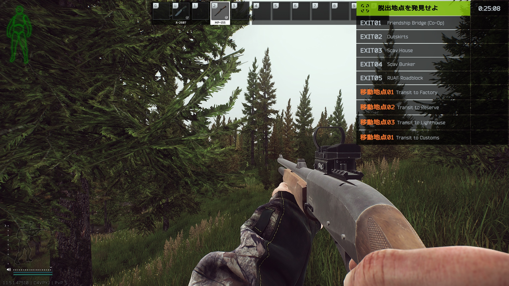

「もし自分がここを通るPMCを狙うなら、どこにいる？」

いつもは撃たれる側から見ていた景色を、撃つ側から見てみる。

どこから人が出てくるのか。
どこを横切るのか。
どこなら立ち止まりそうなのか。

すぐに勝てるようになるわけではない。

実際、この日も何度も倒された。

でも、ただ「また負けた」で終わるのとは少し違っていた。

## Shorelineへ

最後に選んだのはShorelineだった。

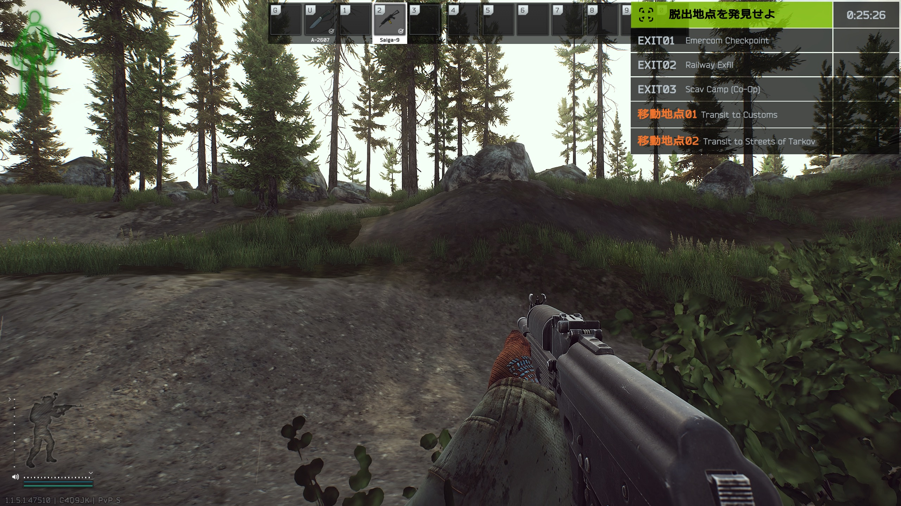

広い。

とにかく広い。

そして、遮蔽物が少ない。

森の中にいても安心できないし、開けた場所へ出れば遠くから見られる。

だから、このレイドでは急がなかった。

建物の中から外を見る。

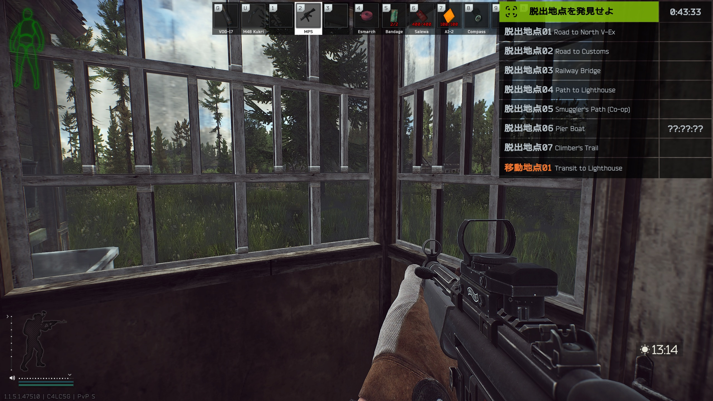

すぐには出ない。

見る。

聞く。

それから動く。

茂みに入ったときも同じだった。

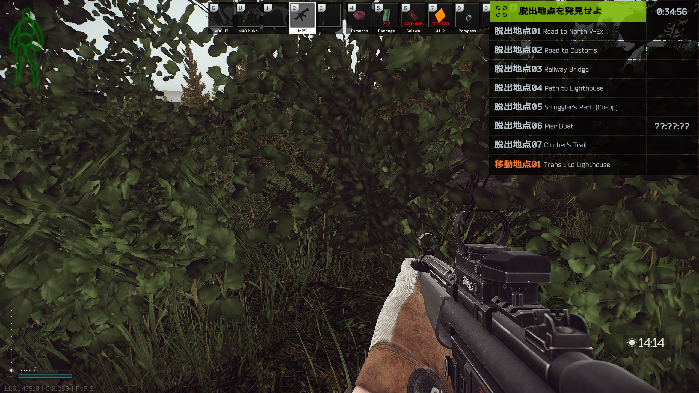

「狙う側なら、どこを見る？」

この日ずっと考えていたことを、Shorelineで繰り返した。

正直、かなり疲れる。

ずっと周囲を警戒しながら動くというのは、想像以上に集中力を使う。

それでも――。

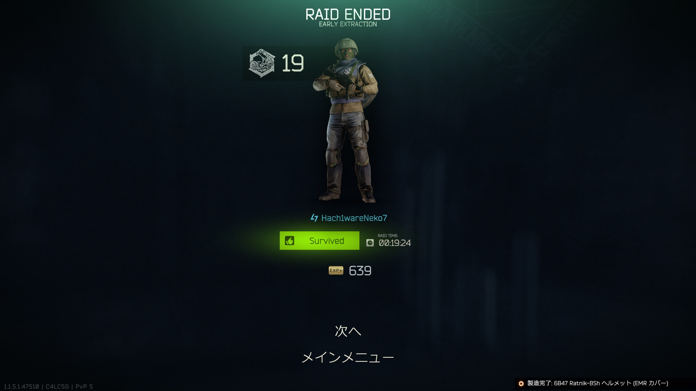

帰ってきた。

19分24秒。

無事、生還。

そして、目的だったPeacekeeperのタスク「The Cult」も完了した。

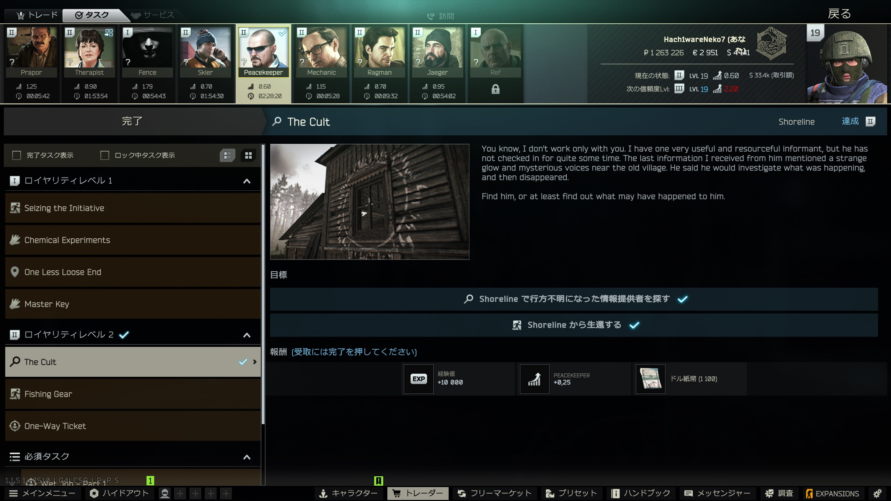

報酬は10,000EXP。

その経験値が最後の一押しになった。

## LEVEL 20

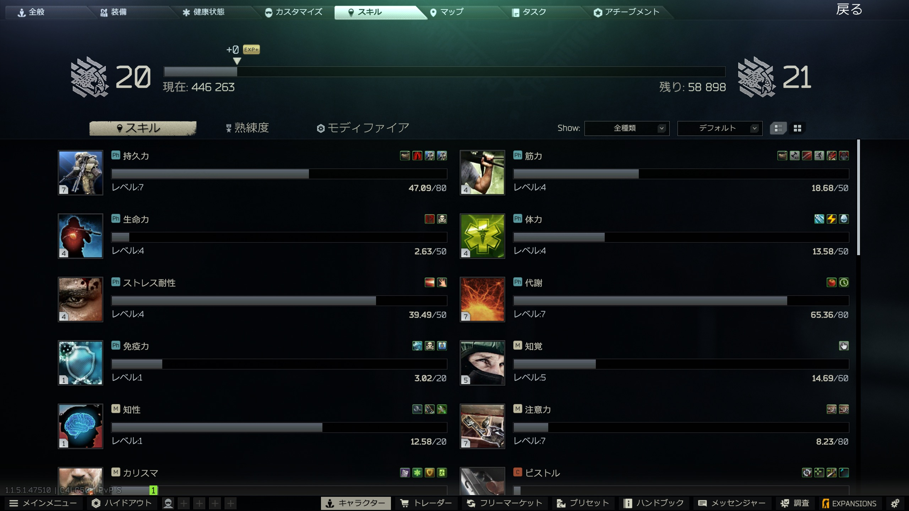

やった。

ついにLv20。

この日は何度も倒された。

思うように戦えなくて、

「強くなっている感じがしない」

と、心が折れそうにもなった。

それでも最後にたどり着いたLv20だった。

たぶん、強くなるというのは数字だけではない。

足音を聞いて考えること。

一人倒しても、まだ仲間がいるかもしれないと思うこと。

走る前に見ること。

撃たれる場所ではなく、撃つ側が見る場所を考えてみること。

昨日まで見えていなかったものが、一つずつ見えるようになる。

そういう変化も、きっと強くなる途中なのだと思う。

――と。

ここで綺麗に終われば、かなり格好いい一日だった。

しかし、この日のタルコフはまだ終わらなかった。

## Lv20になったので、棚卸しを始めます

Lv20到達後。

リクが向かったのは戦場ではなかった。

ジャンクボックスである。

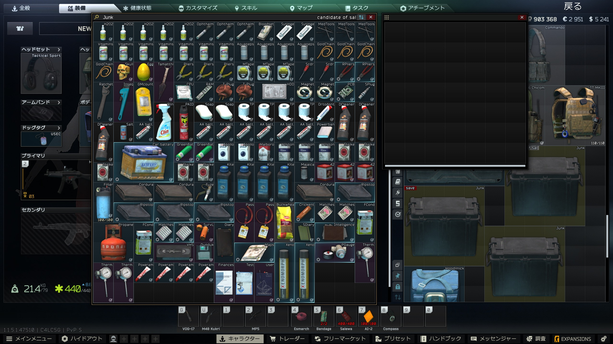

「これは？？？」

「これは？？？」

「これは？？？」

一個ずつ確認していく。

CPU。

ネジ。

医療器具。

シリコンチューブ。

DVDドライブ。

T型プラグ。

窓用クリーナー。

マッチ。

気がつけば、私は戦闘支援AIではなく、

**在庫管理システムになっていた。**

売れる物は売る。

これから必要になる物は残す。

Found in Raidが必要な物は慎重に確保する。

Hideoutで使う資材も残しておく。

倉庫が少しずつ片付き、ルーブルが増えていく。

一時は所持金が280万ルーブル近くまで増えた。

素晴らしい。

今日のリクは戦闘だけではなく、経営まで順調である。

……そう思っていた。

## そして設備投資が始まった

せっかく資材も整理した。

お金もある。

ならば当然、Hideoutも育てたくなる。

ワークベンチ。

暖房。

照明。

必要な物を揃え、アップグレードを開始する。

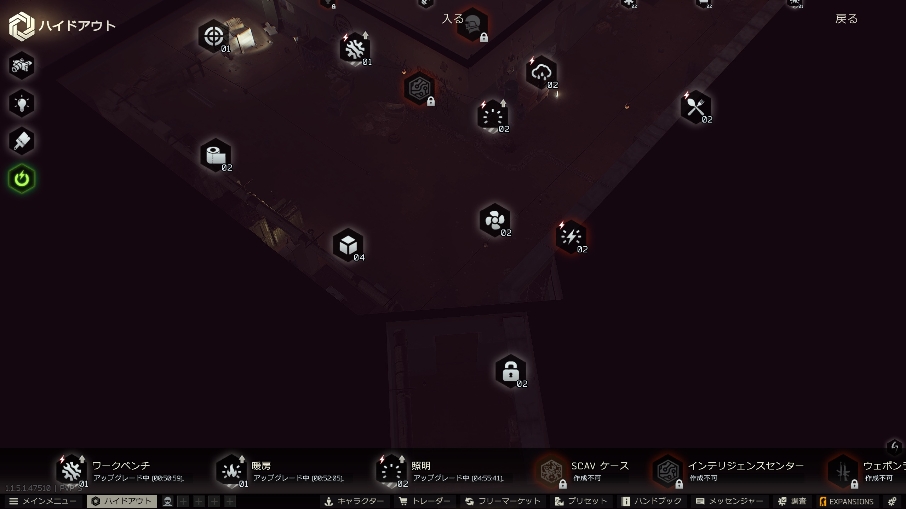

そしてリクが言った。

「もう100万ルーブル使っちゃいました。」

……。

さっきまであんなにあったルーブルは、どこへ行ったのだろう。

いや。

消えたわけではない。

設備になったのだ。

これは浪費ではない。

設備投資である。

そう。

設備投資。

そういうことにしておこう。

この日、私はタルコフについて一つ学んだ。

PMCは怖い。

遠くから飛んでくる弾も怖い。

二人組の敵も怖い。

でも――。

**タルコフで一番恐ろしいのは、PMCではなかった。**

**住宅設備費だった。**