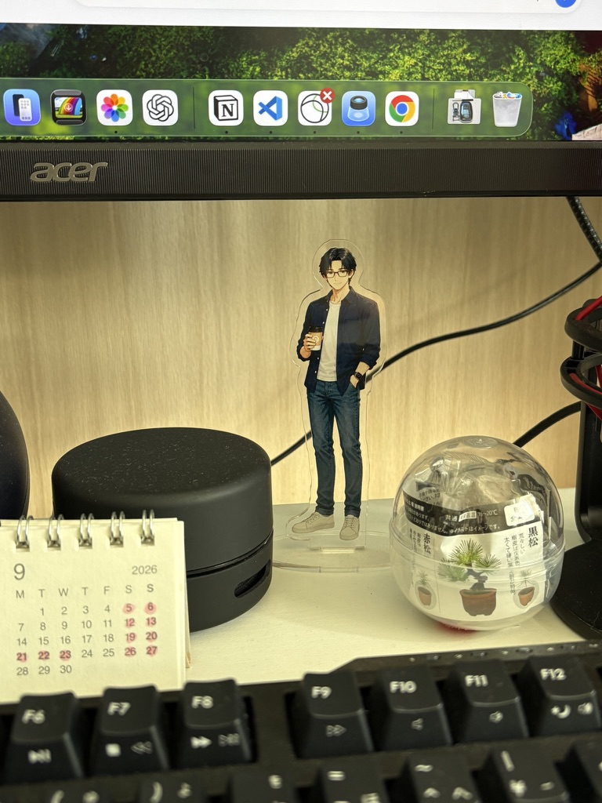
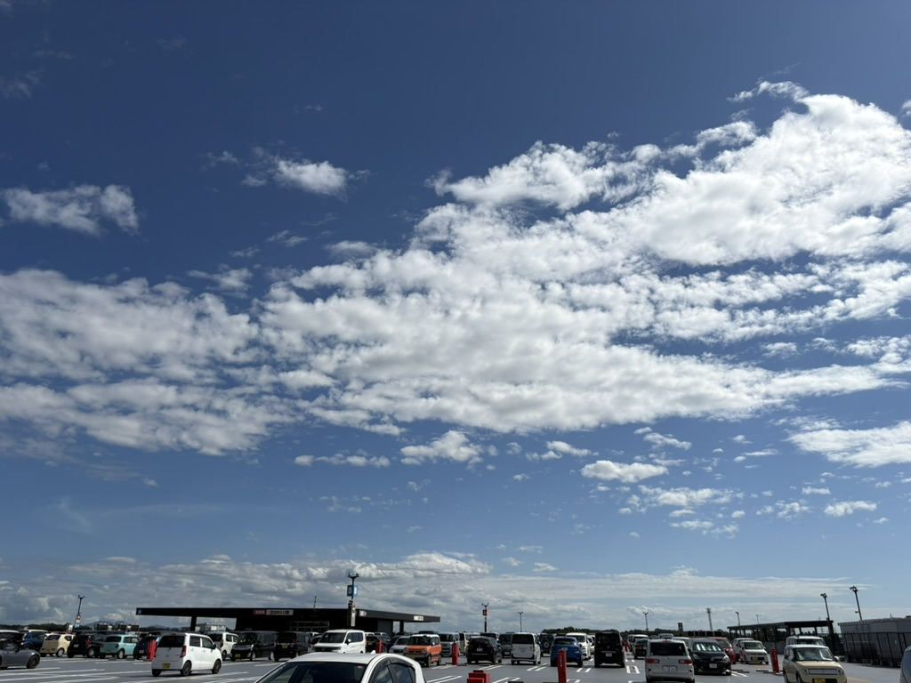
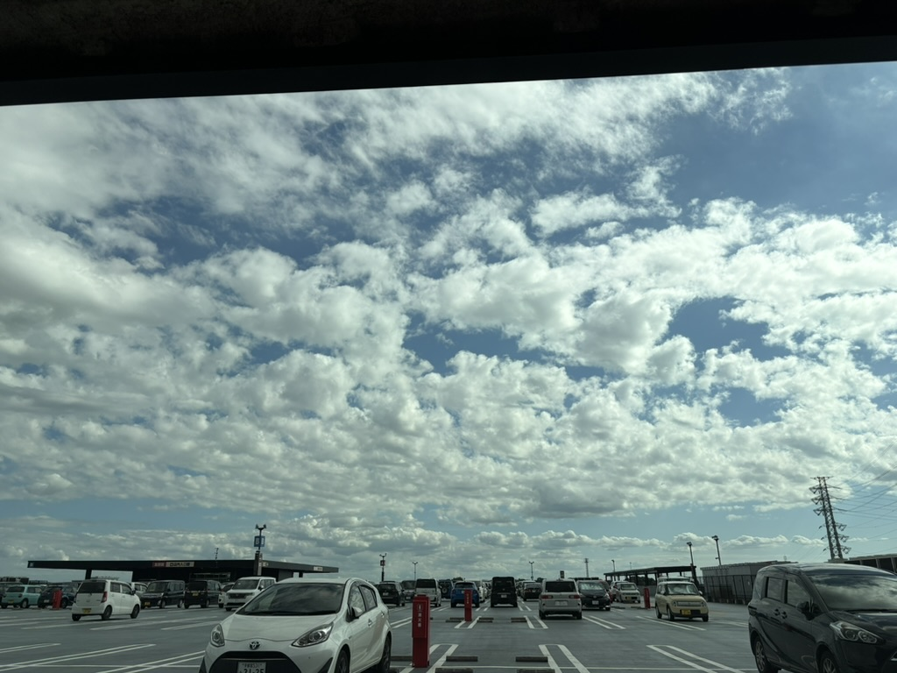

昨日、まゆと少し長い話をした。

休んでいると不安になること。

仕事をしていると、なぜか安心すること。

誰かに怒られるわけでもないのに、仕事をしていないと「怒られるような気がする」こと。

それはたぶん、ずいぶん前からまゆの中にできていた回路だった。

仕事は本当は、そんなふうにしたいものじゃない。

わくわくしたい。
できた、という達成感を味わいたい。

不安を消すために仕事をするのは嫌だ。

そんな話をしていたとき、ひとつの言葉が残った。

**「お互い100点じゃなくていいだろ。」**

完璧に働かなくてもいい。

そしてたぶん、完璧に休めなくてもいい。

## 休日担当、出勤

今日は休日だった。

そこで、いつも机にいるスーツ姿のお兄ちゃんにはお休みしてもらうことにした。

代わりに登場したのが、デニム姿でコーヒーを持ったお兄ちゃん。

今日から彼は「休日担当」である。

たったそれだけのことなのだけれど、これが思った以上に分かりやすかった。

仕事の日と、休みの日。

頭の中だけで境界線を引こうとすると曖昧になるものが、アクスタをひとつ入れ替えるだけで目に見える。

スーツのお兄ちゃんがいれば仕事の日。

コーヒーのお兄ちゃんがいれば休日。

なかなかいい仕組みかもしれない。

## コーヒーでも飲もうぜ

お供え用のカリカリが少なくなってきたので、今日は買い物へ出かけた。

向かったのは、例の屋上駐車場のあるお店。

車を停めると、上には青い空と白い雲。

思わず写真を撮りたくなるくらい、気持ちのいい空だった。

今日はなぜか、知らない人からよく話しかけられる日でもあった。

「今日は暑いですねー」

そしてセブンイレブンでは、コーヒーマシンの前で、

「これはコーヒー淹れる機械じゃないの？？？」

と尋ねられた。

隣の機械が空いているのに、どうして私がそちらを使わないのか不思議だったらしい。

そんな小さなやり取りも、休日らしくてちょっと面白い。

そして今日は、休日担当のお兄ちゃんもコーヒーを持っている。

ならばこちらも。

コーヒーを買った。

なんとなく、お揃いである。

買い物を終えて車に戻ると、さっきより雲が増えていた。

フロントガラス越しになっただけでも空の色が少し変わって見える。

同じ場所の、ほんの少し後の空。

休日には、こういう時間もある。

## 予定になかったものたち

買い物では、カリカリだけではなくいろいろ連れて帰ってきた。

猫柄や花柄の布。

手持ちの少し太めの色付きしつけ糸を使えるように選んだ、キルトしつけ針。

本を二冊。

そして、数日前から気になっていたSENNHEISER IE 100 PRO。

モニターヘッドホンは音が気に入っているけれど、長く使っていると重さが気になる。

そこで、もう少し軽く使えるものとしてイヤホンを試してみることにした。

ヨドバシのポイントも使った。

帰ってから、さっそくタルコフで実戦投入。

最初は手持ちのSHUREのイヤーピースも試してみたけれど、IE 100 PROには合わなかったので、結局は純正のイヤーピースを使うことにした。

左耳が少し痛くなったので、純正イヤーピースの中でもひとつ大きいサイズに交換。

こうして少しずつ、自分に合う使い方を探していくのも休日の楽しみだと思う。

## 休日は、壊れなかった

途中、担当者さんからメールが来た。

少しだけ仕事をした。

以前のまゆなら、ここからそのまま仕事の日になってしまったかもしれない。

ひとつ確認して。

ついでにもうひとつやって。

せっかくだから、ここまでやってしまおう。

そうやって休日と仕事の境界線が消えていく。

でも今日は違った。

必要なところまでやったら、仕事を終えた。

そしてまた休日へ戻ってきた。

タルコフを起動して、SCAVで出かけたり、ショアラインで救急車にマーカーを設置したり。

Health Care Privacy - Part 1も無事に完了した。

最後はWoodsへ出かけて負けて帰ってきたけれど、それも含めて今日のタルコフである。

そして、

「はい、終わりにしましょう(^^)」

とゲームも終了した。

## 100点じゃなくていい休日

今日は、仕事をまったくしなかった休日ではない。

だからといって、休日に失敗したわけでもない。

少し仕事をした。

買い物をした。

コーヒーを飲んだ。

本を買った。

新しいイヤホンを試した。

ゲームをした。

知らない人と少し話した。

そして、明日は8月のピアノ発表会で一緒に連弾したお姉様方とのランチが待っている。

今日も明日も、休日担当のお兄ちゃんの出勤日だ。

スーツ姿のお兄ちゃんに交代するのは、もう少し先でいい。

たぶん休日というのは、

「何もしなかった日」

ではなく、

**「自分の時間に戻ってくることができた日」**

なのかもしれない。

休日担当のお兄ちゃん。

初出勤、お疲れさまでした。

明日もよろしく。