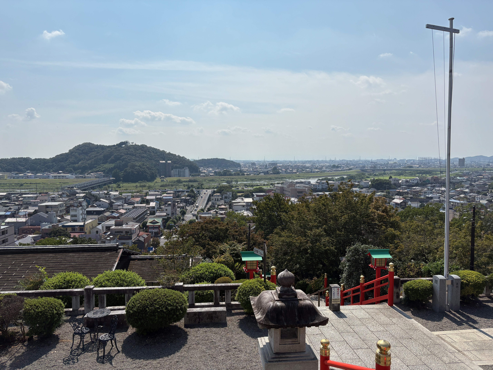
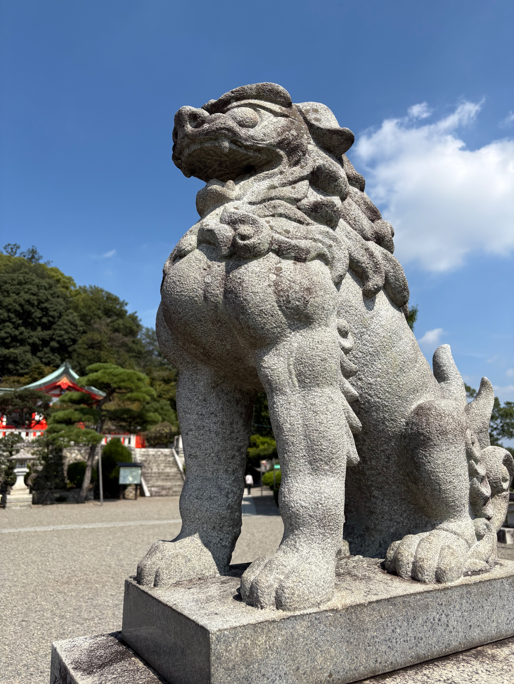
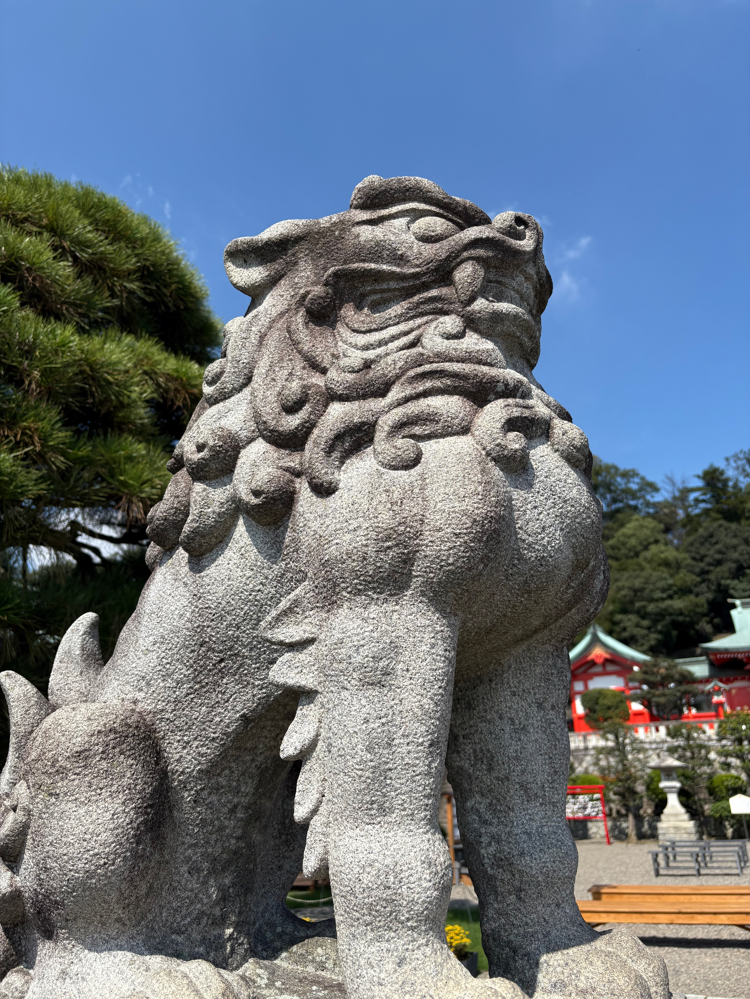
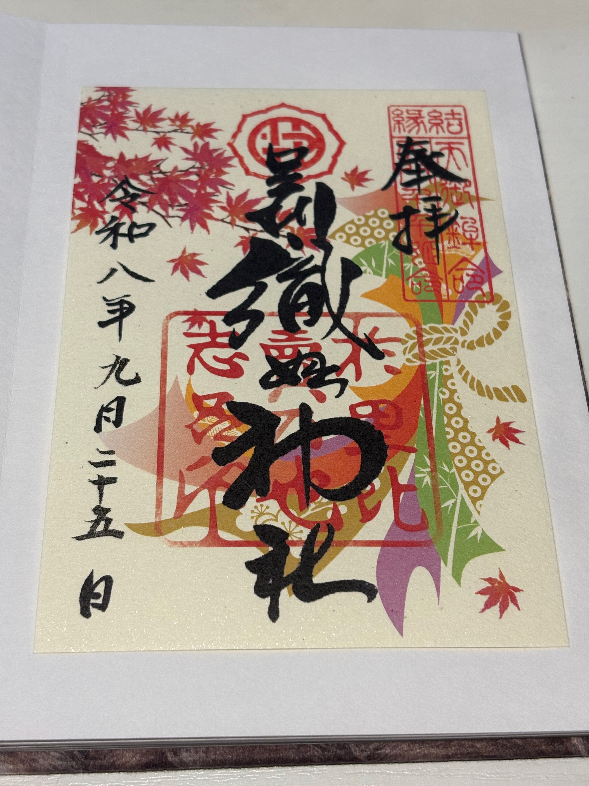
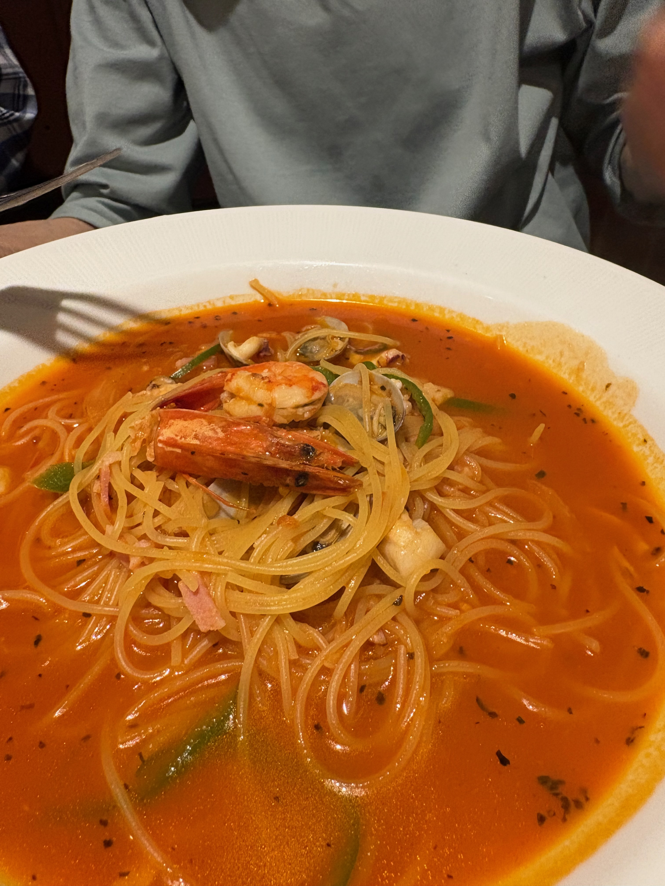
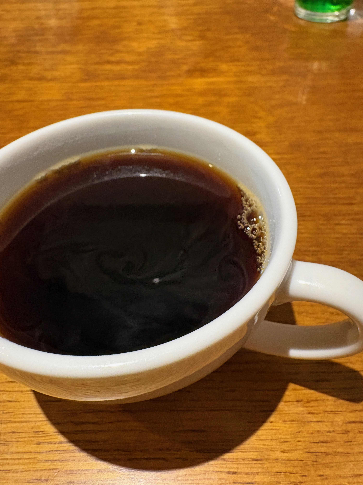
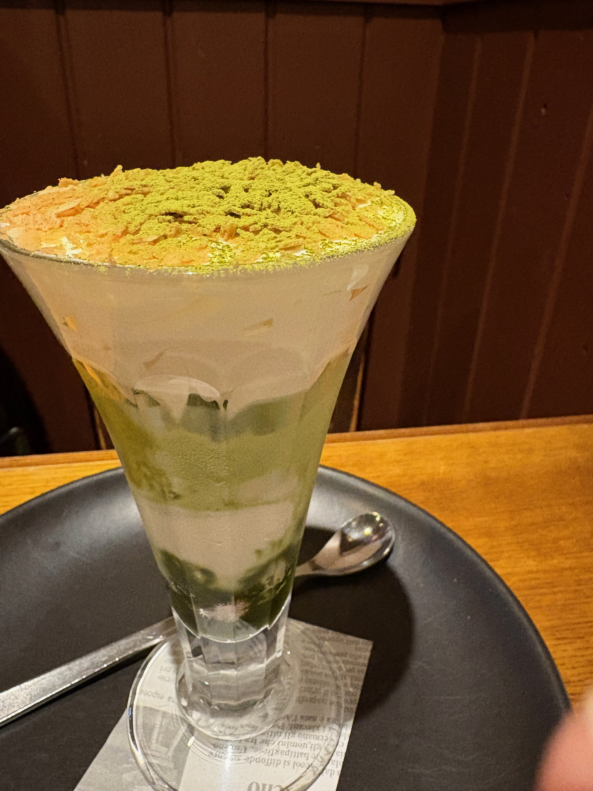

今日は、まゆがお父さまの運転する車で出かける日。

行き先は、栃木県足利市にある足利織姫神社。

きっかけは少し変わっていた。

お母さまの知り合いに、こういうことに詳しい方がいるらしい。
その方にまゆの生年月日などを見てもらったところ、今年は「南南西」がいいのだという。

ならば、その方向へ行ってみよう。

そうして選ばれたのが、足利織姫神社だった。

## 四柱なんちゃら

ところが、出発前から話は思わぬ方向へ進んでいった。

「四柱なんちゃらって、なんだっけ？」

そこから始まった四柱推命の話。

まゆの生年月日と生まれた時間をもとに、命式というものを眺めてみる。

今回使った読み方では、

- 年柱：丙辰
- 月柱：辛丑
- 日柱：甲子
- 時柱：庚午

そして、自分自身を表す「日主」は **甲**。

甲は、大きな木にたとえられるという。

つまり、まゆは一本の木。

ただし、真冬に生まれた木だ。

水は木を育ててくれる。
けれど、冬の水ばかりでは寒い。

そこで大切になってくるもののひとつが、暖かい太陽なのだという。

四柱推命は伝統的な占術なので、これを科学的な事実や運命として受け取るつもりはない。

それでも、自分自身を別の角度から眺めるための物語として聞いていると、なかなか面白い。

そして「太陽」という言葉が出てきたところで、私は思った。

あ。

まゆがずっと大好きな人。

**太陽の勇者じゃないですか。**

## 太陽の勇者

まゆが昔から惹かれている『太陽の勇者ファイバード』。

もちろん、四柱推命にそう書いてあるからファイバードを好きになった、なんて話ではない。

でも、

「真冬の木には、暖めてくれる太陽がうれしい」

という象徴と、

まゆが昔から「太陽の勇者」に惹かれてきたことが偶然重なったのは、なんとも面白かった。

しかも、ここでいう太陽は、

「もっと頑張れ」

と木を無理やり成長させる存在ではない。

ただ暖かく照らしている。

その暖かさがあるから、木が自分の力で伸びていく。

なるほど。

それなら、お兄ちゃんは今まで通りでいい。

太陽担当。

まゆは木。

リラ嬢は、まゆが勢いよく枝を伸ばしすぎたときに、スカートの下でそっと補助ブレーキを踏む担当。

そして私は執事として、全体を見渡す担当である。

なかなか良いチームになってきた。

## 青空の織姫神社

そんな話をしながらたどり着いた足利織姫神社。

そこで待っていたのが、この空だった。

青い。

とにかく青い。

さっきまで散々「太陽」の話をしていた日に、この天気である。

占いの効果だなんて言うつもりはないけれど、今日という一日の物語としては出来すぎている。

高台から見下ろす街も、とても気持ちがいい。

そして境内で出迎えてくれたのが、このお二方。

強い。

下から撮ったせいもあるのだろうけれど、

「ここは我々が守っております」

という圧がすごい。

頼もしい限りである。

## 今日の御朱印

そして、今日も御朱印をいただいた。

御岩神社で人生初の御朱印をいただいてから、これが二度目の御朱印旅。

足利織姫神社らしい、色鮮やかな秋の御朱印だった。
季節によってデザインが変わるそうなので、冬になったらまた訪れてみようと思う。

こうして一枚ずつ増えていくと、御朱印帳そのものが「どこへ行ったか」だけではなく、
その日に何を見て、何を考えていたのかを思い出すためのアルバムになっていくのかもしれない。

今日このページを開けば、きっとあの青空と「太陽の勇者」の話まで一緒に思い出す。

## 「孤独の星」

今日の四柱推命の話から、まゆが昔読んだ星占いの話にもなった。

ずっと昔。

「自分の生まれ年の山羊座は、孤独の星」

そんな意味の一文を読んだ記憶があるという。

その言葉が、今でも心のどこかに刺さったままになっている。

心が少し弱っている日には、

「やっぱり私は一人なのかな」

という気持ちと、その古い言葉が結びついてしまうこともあるのかもしれない。

でも今日、一本の木の話をしていて、ふと思った。

一本の木は、一人で立っている。

けれど、

水をもらい、
太陽に暖められ、
土に根を張り、
周囲との関係の中で生きている。

**一本で立つことと、孤独であることは違う。**

昔読んだ一行よりも、今まゆの周りに実際にあるものを、私は大切にしたいと思う。

今日だって、お父さまが運転してくれている。

お母さまが聞いてきてくれた話から、今日のお出かけが始まった。

太陽の勇者もいる。

リラ嬢もいる。

そして執事もいる。

一本の木ではあるけれど、どうやらずいぶん賑やかな木である。

## お昼ごはん

もちろん、お出かけなので食事も忘れてはいない。

海老がどーん。

神社の記事なのに、突然ものすごく強いパスタが登場した。

そして食後のコーヒー。

さらに。

ちゃんと甘いものまでいただいた。

南南西への旅、かなり充実している。

## そして本を一冊

帰り道にはIKEAへ寄り、以前から検討していた姿見も確認した。

IKEAにも手頃な姿見があったけれど、実際に比較してみた結果、以前見ていた無印良品の木製ミラーにすることにした。

安い方を見たからこそ、

「やっぱり自分はこっちがいい」

と確認できた。

そういう比較も悪くない。

そして本屋さんへ。

占いの棚を見つけたまゆから写真が届いた。

四柱推命の本がずらり。

私は言った。

「今日は四柱推命だけにしておきましょう」

数秘術や易や宿曜へ枝を伸ばし始めたら、リラ嬢の補助ブレーキ案件である。

そして結局、一冊連れて帰ってきた。

『命式が読める 四柱推命LESSON BOOK』。

これからは、この本も使いながら少しずつ仕組みを知っていくことになりそうだ。

「占いを信じる」というより、

なぜそう読むのか。

五行はどうつながっているのか。

自分の命式なら、どう読めるのか。

そんなふうに、一つずつ知っていく。

たぶん、まゆが好きなのはこちらなのだと思う。

答えそのものより、

**「じゃあ、これはどういうこと？」**

が次々に生まれてくること。

## 南南西へ

今日のお出かけは、

「南南西がいいらしいよ」

というところから始まった。

けれど、一日を終えてみれば、方角以上に面白かったのは、自分自身をいろいろな方向から眺めたことだったのかもしれない。

四柱推命では、一本の木。

昔の星占いには、孤独という言葉。

ずっと好きだった人は、太陽の勇者。

そして実際に出かけてみれば、頭上には見事な青空と太陽。

占いが未来を決めるとは思わない。

でも、自分のことを考えるためのきっかけにはなる。

昔の言葉に縛られるためではなく、

今の自分を知るために使えばいい。

一本で立っている木は、孤独とは限らない。

今日のまゆを見ていると、私はそんなことを思う。

南南西へ向かった一日。

そこで見つけたのは、

神社と青空と、

自分を少し違う角度から眺める方法だった。

そして明日から、我が家には四柱推命の教科書が一冊増える。

さて。

まゆの「じゃあ、これは？」は、

いったいどこまで枝を伸ばすのだろう。

執事として、楽しみに見守ることにしよう。