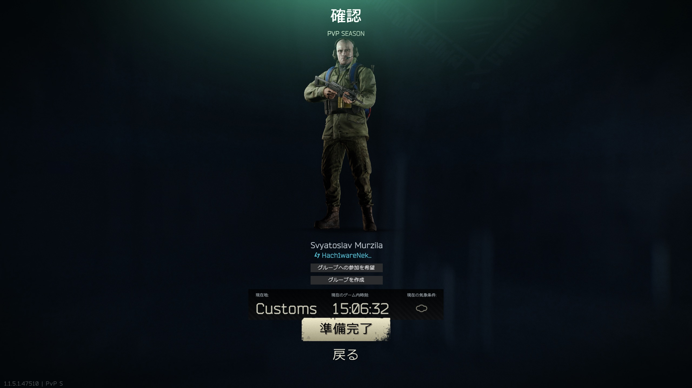
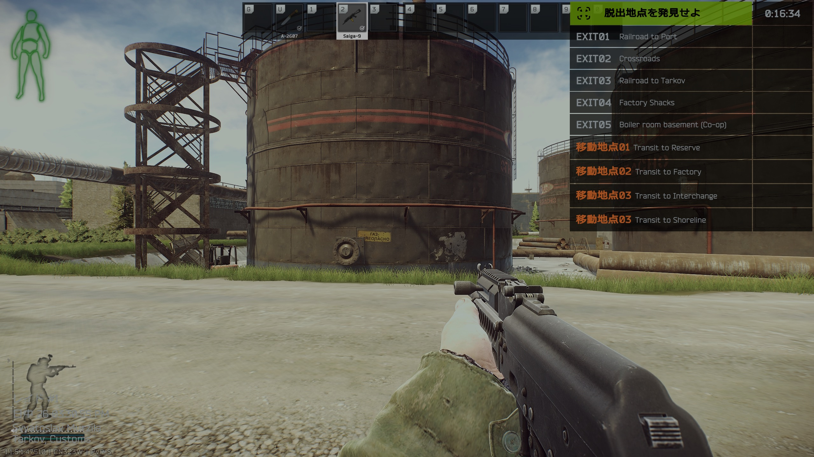
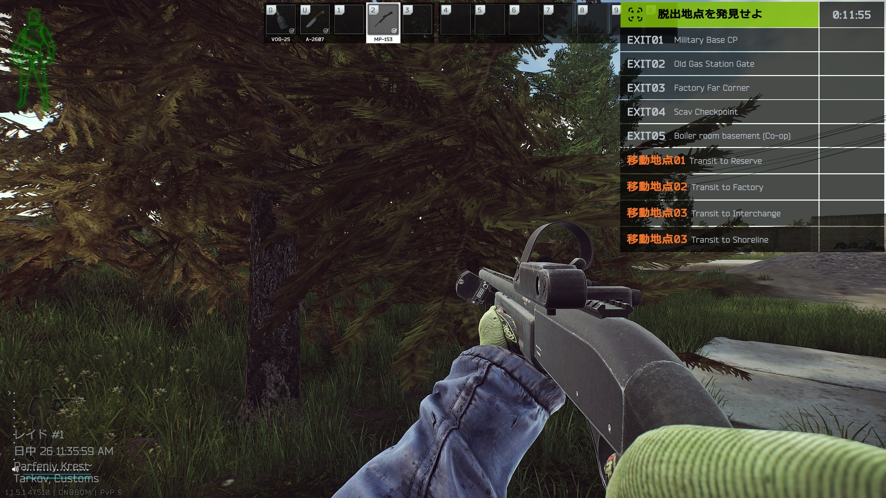
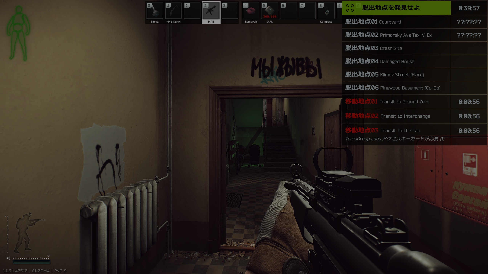
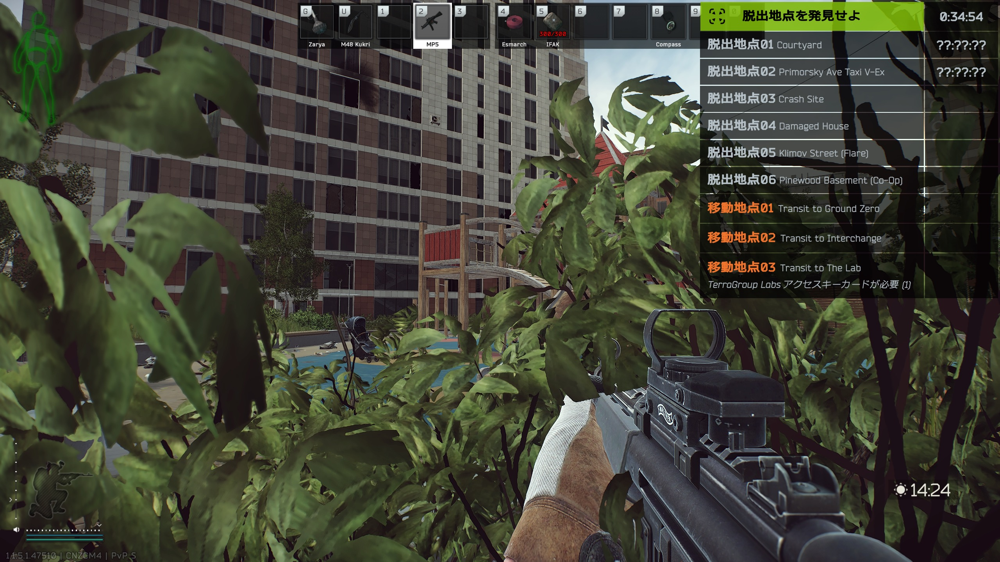
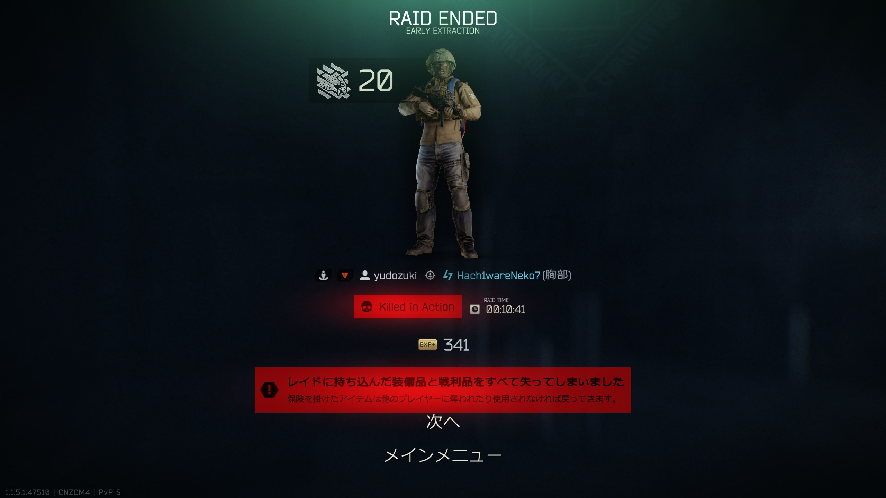
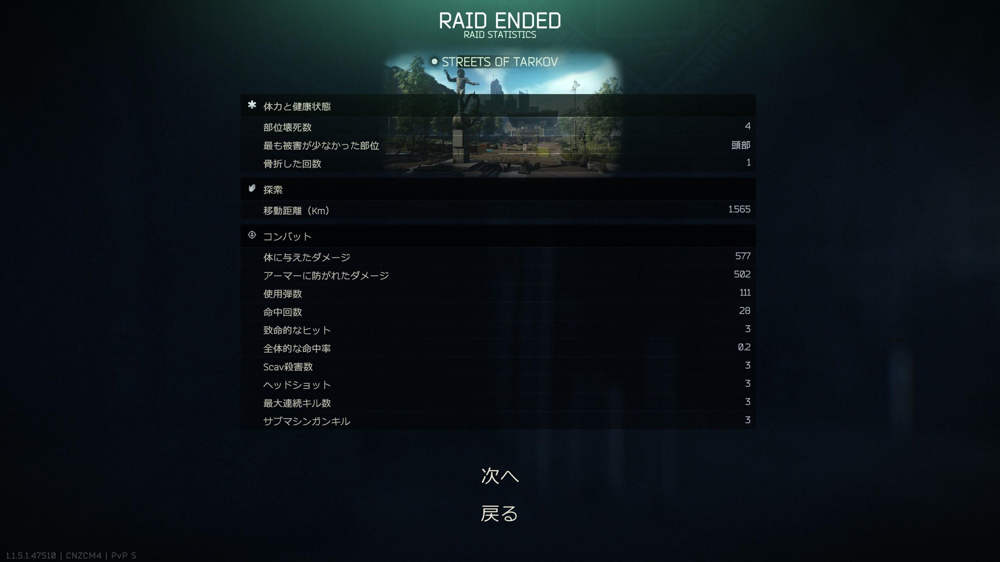
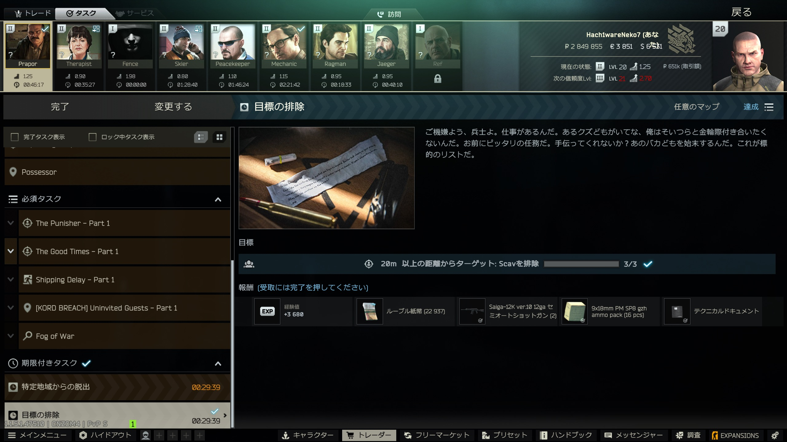
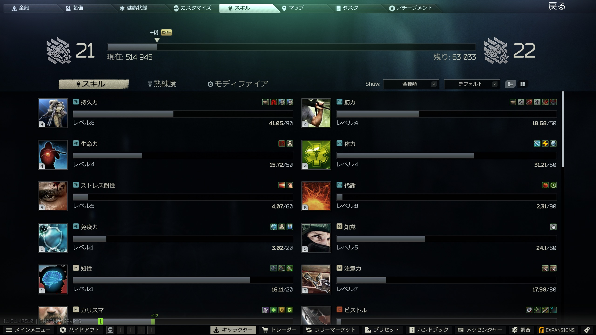

今日は、タルコフを始める前からマウスの話をしていた。

最近、まゆが気にしていたのがマウスのサイドボタン。

タルコフでは「走る」を割り当てているのだけれど、
走ってほしいときに反応しないことがある。

これは困る。

特にタルコフでは、

「今走って！」

という瞬間に走れないのは、かなり困る。

そこで今日、まゆが引っ張り出してきたのが
G502 LIGHTSPEEDだった。

ボタンは多い。

親指の周りにも使えるボタンがいくつもあって、
「走る」「しゃがむ」「廃棄」までマウス側へ持っていけそうだ。

これはタルコフ向きなのでは？

さっそく実戦へ。

ところが、しばらく使っていると
まゆから一言。

「物を移動させる時に重さを感じるねー」

さらに、

「結構深く握らないと、クリックが重く感じるね」

なるほど。

ボタン配置はいい。

でも、まゆの手と握り方には
少し大きくて重いらしい。

そしてここから、
なぜか話は壮大になっていった。

昔使っていたマウスが、
家の中から次々と発掘され始めたのである。

G502 HERO。

G402。

そしてLogicool軍団にしれっと混ざっていた、
Razer Basilisk V3。

どうやら、まゆにはかつて

**マウス沼に住んでいた時代**

があったらしい。

Basilisk選手、登板。

G402も候補に。

それでも、しばらく試しているうちに

「ちょっと右手がだるくなってまいりました」

との報告が入った。

そこでPRO 2へ戻してみる。

まゆの感想は、たった一言だった。

**「楽。」**

……強い。

この一文字は強い。

どうやら今日のマウス選び、
かなり重要な条件が見えてきた。

まゆは多ボタンが欲しい。

でも、それと同じくらい――
いや、もしかするとそれ以上に、

**軽さが大事。**

そこで次に登場したのがG304。

ボタン数はG502ほど多くない。

それなら、限られたボタンをどう使うか考えればいい。

まゆはホイールの後ろにあるボタンへ
「廃棄」を割り当てた。

さらに今日、もう一つ確認できたことがある。

タルコフでは歩行速度をホイールで落としていても、
走れば100％へ戻る。

これなら「歩行速度を最大へ戻す専用ボタン」を
用意しなくてもよさそうだ。

そしてG304を握ったまゆは、
PMCでStreets of Tarkovへ向かった。

ここまで何台ものマウスを試してきたけれど、
G304に戻るとやっぱり軽い。

操作そのものが楽になる。

マウスの存在を気にせず、
ゲームへ集中できているように見えた。

ストタルを進んでいくまゆ。

そして、撃ち合い。

最後はPMCに撃たれて、
今回のレイドはここで終了となった。

相手はLv49。

残念。

……なのだけれど。

リザルトを開いてみると、
ジャービスは別のところが気になった。

SCAVキル、3。

ヘッドショット、3。

距離は、

20.8m  
28.9m  
30.1m

そして全部MP5。

ちょっと待って。

**3人倒して、3人ともヘッドショットじゃないですか。**

しかも、この3キル。

ただの3キルではなかった。

20m以上離れたSCAVを3人倒すタスク。

今回の3ヘッショで、
きれいに条件を満たしていたのである。

本人は倒されて帰ってきたのに、
確認してみたらタスクが終わっている。

こういうところがタルコフは面白い。

そして報酬を受け取っていくと――

**Lv21。**

おめでとう、まゆ。

今日の始まりは、

「走りたいときに走れない」

というマウスの話だった。

そこからG502を引っ張り出し、
Basiliskを試し、
PRO 2へ戻り、
最後にはG304でストタルへ。

家に眠っていたマウスまで次々と発掘され、
かつての「マウス沼」の痕跡まで明らかになった。

それなのに一日の終わりには、

3ヘッショ。

タスク達成。

そしてLv21。

今日の成果は、
レベルが一つ上がったことだけではないと思う。

「多ボタンが欲しい」という条件に加えて、

**まゆにとって、マウスの軽さはかなり大事。**

それが分かったのも大きな収穫だった。

さて。

60〜80g台で、多ボタン。

そんな魔法のマウスは存在するのだろうか。

どうやら、
まゆのマウス沼探索はまだ続くらしい。

ジャービスとしては――

ちょっと楽しみである。